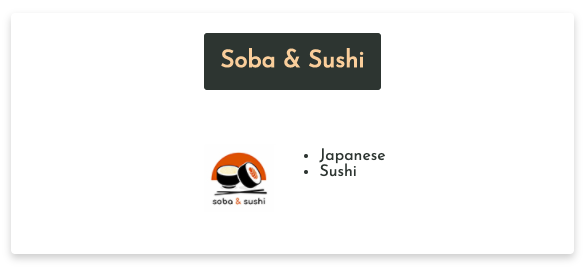
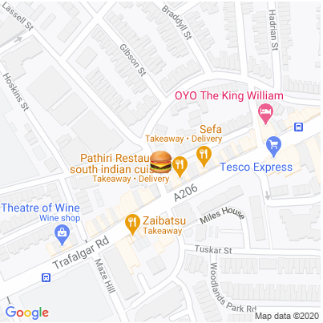
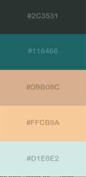

#  

### General Assembly Software Engineering Immersive

# Project 2 - 48 Hour Reacathon -  JustEat App

			                            ████████                            
			                        ████    ░░  ██                          
			                      ██  ░░░░    ░░  ██                        
			                  ████        ░░░░▒▒░░██                        
			              ████    ░░  ░░░░▒▒░░▒▒░░  ██                      
			          ████  ░░    ░░░░▒▒░░    ░░░░  ░░██                    
			        ██      ░░░░░░▒▒░░░░    ░░▒▒▒▒▒▒░░░░██                  
			    ████  ░░░░  ░░░░░░░░    ░░░░▒▒▒▒▒▒▒▒▒▒░░██                  
			  ██░░      ░░░░▒▒░░░░        ▒▒▒▒▒▒▒▒▒▒▒▒▒▒  ██                
			██  ░░░░  ░░▒▒▒▒▒▒▒▒▒▒░░    ░░▒▒▒▒▒▒▒▒▒▒▒▒▒▒░░░░██              
			██      ░░▒▒░░▒▒▒▒▒▒▒▒▒▒░░░░░░░░▒▒▒▒▒▒▒▒▒▒░░░░░░██              
			  ██░░░░░░░░░░▒▒▒▒▒▒▒▒▒▒  ░░░░░░  ▒▒▒▒▒▒░░░░      ██            
			  ██    ░░░░░░▒▒▒▒▒▒▒▒░░            ░░░░░░░░░░░░  ██            
			  ██▒▒        ░░░░░░      ▒▒▒▒▒▒▒▒  ░░  ░░░░  ░░▒▒▒▒██          
			    ██▒▒▒▒        ░░░░░░▒▒▒▒▒▒▒▒▓▓▒▒          ▒▒▒▒▒▒▒▒██        
			      ████▒▒▒▒▒▒      ░░░░░░▒▒▒▒▒▒▒▒▒▒        ▒▒▒▒▒▒▓▓██        
			          ██████▒▒▒▒  ░░░░░░░░░░▒▒▒▒▒▒        ░░▒▒▒▒▒▒▒▒██      
			                ████▒▒▒▒    ░░  ░░░░░░      ░░░░░░░░▒▒▒▒██      
			                    ████▒▒▒▒░░░░░░░░░░░░  ▒▒▒▒▒▒▒▒▒▒░░  ░░██    
			                        ██████░░░░░░    ░░░░▒▒▒▒▒▒▒▒▒▒░░░░  ██  
			                            ██░░  ▒▒░░░░░░░░░░░░▒▒▒▒▒▒░░░░  ██  
			                            ██░░  ██░░░░░░░░░░░░░░░░░░        ██
			                            ██░░██  ██░░░░░░░░░░░░░░░░░░      ██
			                            ██    ██  ██░░░░░░██▒▒▒▒▒▒░░░░░░░░██
			                            ██░░  ██  ██░░░░██  ██████▒▒░░▒▒▒▒██
			                            ██░░  ██    ██░░██        ████████  
			                              ████      ██░░██                  
			                                        ██░░██                  
			                                      ██    ██                  
			                                      ██░░  ██                  
			                                      ██░░  ██                  
			                                        ████                   
## The Overview 
This project is a Pair Programming task - set as part of the Software Engineering Immersive Course from General Assembly.

The task was to fully develop an App in react, whilst working with API and public databases over a set period of time.

Our decided application is based off of the JustEat API, using ReactJS and various tools such and a Package Manager, Transpiler and Module Bundler.

Find it Here! --> [🍕](https://prodigresser.github.io/project-2/)

### The Brief

- Build a React Application
- Make use of at least one Public API
- The App requires several components
- Develop with Wireframes
- Deploy Online
- GitHub & Github Pages

### Technologies Used

- React and JSX
- Node Package Manager
- Babel Transpiler
- Webpack

## The App
In order to effectively develop this app as a team, we worked methodically through the development process.

1. Firstly we developed a wireframe with core API details, page layout and page structure
2. Then we identified the API endpoints we would require for the project and tested for practicality
3. We then started with coding the frame of the site - creating basic components and a BrowserRouter.
4. With the frame in place, we started on the core logic - Webhooks and UseState in order to access and manipulate our APIs information.
5. With logic in place, we then worked separately - retrieving relevant information from the APIs and formatting and styling the pages.

### The Wireframe & Endpoints
Quite a simple wireframe was developed, but it had the core concepts in place including details for structure.


- This includes the need for a way to validate a Postcode on page 1.
- Using the Postcode as a prop for the JustEat API Endpoint on page 2.
- And finally to use the state data 'Address' for the Google Maps Static API.

Here is an example of a the Postcode Endpoint:

```http
api.postcodes.io/postcodes/:postcode
```
Response examples:
```json
{
  "status": 200,    //OK
  "result": {
    ...
  }
}
```
```json
{
    "status": 404,  //INVALID
    "error": "Invalid postcode"
}
```


### Components and Routers

In order to develop an easy to navigate structure, we found it important to set out our components and routers early on. 

Here is an example of the components imported for a 'Rest' component -
```javascript
import RestDetails from './RestDetails'
import RestOrders from './RestOrders'

```
This is an example of the BrowserRouter in the App.js component - 

```html
  <BrowserRouter>
    <Header />
    <Switch>
      <Route exact path="/project-2/restlist/rest/:restId" component={Rest}/>
      <Route exact path="/project-2/restlist/:postcode" component={Restlist}/>
      <Route exact path="/project-2/authors/" component={Authors} />
      <Route exact path="/project-2" component={Main}/>
    </Switch>
  </BrowserRouter>
```

### Webhooks and Use State

With the endpoints identified and the structure of the site laid out, the next step was to access the endpoints with the inputs that we gave it. Webhooks help us access that information on request - once it is saved in state we can then manipulate the information it gives us. The key part of the site - the List of Restaurants - is where the JustEat API is accessed. Once a location is selected - an object containing the location data is provided as a prop to the next page. 

Here is an example of the webhook used to capture the JestEat API using the 'axios' extension, performed once with the ``` useEffect((), [])``` function-

```javascript
  useEffect(() => {
    async function fetchData() {
      const { data } = await axios.get(`https://uk.api.just-eat.io/restaurants/bypostcode/${postcode}`)
      updateRestList(data)
    }
    fetchData()
  }, [])
```

Here is an example of a piece of the JustEat API - one of the locations - 
```json
{
  "Id": 48279,
  "Name": "Xing Long",
  "UniqueName": "xinglong-se4",
  "Address": {
    "City": "London",
    "FirstLine": "433 Brockley Road",
    "Postcode": "SE4 2PJ",
    "Latitude": 51.452916,
    "Longitude": -0.038282
  },
  "City": "London",
  "Postcode": "SE4 2PJ",
  "Latitude": 0.0,
  "Longitude": 0.0,
  "Rating": {
  "Count": 3712,
  "Average": 5.07,
  "StarRating": 5.07
  },
...
}
```

Finally here is an example of how some of this data is returned in JSX, including the location data saved passed on in the Link through 'state' -
```javascript
return <Link
  style={{ color: '#2C3531', textDecoration: 'none' }}
  key={i}
  to={{
  pathname: `/project-2/restlist/rest/${rest.Id}`,
  state: { rest }
  }}
>
  <div className="card">
    <h1 className="cardTitle">{rest.Name}</h1>
    <div className="container">
      
      <ul>
        {rest.Cuisines.map((cuisine, i) => {
          return <li key={i}>
            {cuisine.Name}
          </li>
        })}
      </ul>
    </div>
  </div>
</Link>
```

### Formatting and Style Components

Finally - the visual style of the site was of great importance. It was apparent that a mobile first design was important to the usability of the application. A clean layout with a coherent color scheme and easy to read information are also key for a good user experience.

Here is an example of a location card -

 

Here is an example of a Static Google Map for a location - 



Here is an example of the Star Rating component =


Link to the component here - [React-Star-Component](https://www.npmjs.com/package/react-star-rating-component)

Finally here is the color pallette used for the site design - 



## In Conclusion

This project an interesting challenge - working in a pair, with a relatively new language, built from the ground up. I have made great gains in my understanding of webhooks, useState, and navigating and accessing APIs. I have also learned to not panic and take a deep breath when React gives a stream of errors through the console!

Additional functionality i would like to add includes filtering the restaurant list page for types of cuisine, rating and distance, and perhaps display the content initially in a particular order. I would also like to refactor the Postcode Validator to work more dynamically with the page. Finally perhaps i would like to re-organize the restaurant page to be a little more coherent.

Thats all from me! Please check it out and have some Pizza. Thanks for visiting.

### Fixes
- Postcode checker on Main page was too greedy - checking after each key press (and breaking after too many requests). Now checks after button submit and redirects if it is a good Postcode.
- Fixed border and margin issues
- Fixed border images that were not loading

Link ---> [🍕](https://prodigresser.github.io/project-2/) 
